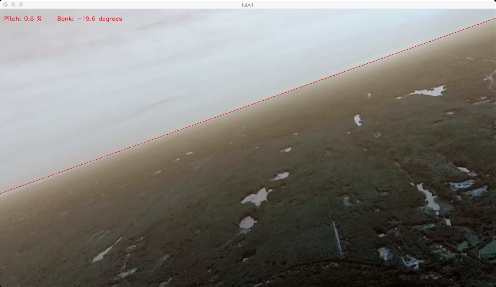

# HorizonCV

Real-time horizon detection with computer vision in Python, for UAV applications. A part of WPI's [ACAP](http://www.acap.io) (Autonomous Cargo Aircraft Project), completed 2016-2017 by Nicholas Bradford (view the MQP report [here](https://web.wpi.edu/Pubs/E-project/Available/E-project-042717-143558/unrestricted/ACAPFinalReport.pdf)). Algorithm source found in [paper](http://www.tandfonline.com/doi/pdf/10.1163/156855303769156983?needAccess=true) and [master's thesis](https://pdfs.semanticscholar.org/9037/e7955e4b7c9339dc34bd75e563a86636cca8.pdf).

    /horizoncv                  Python module.
        demo.py                 Running useful real-time demos
        horizon.py              All the important computation
        plotter.py              Plotting graphs
        archive.py              Archived code that might be useful to view in the future.
    /proto
    /media                      Footage for testing
    requirements.txt            Install with $ python install -r 
    runner.py                   Run tests and a demo.

## Usage

### Requirements

Note that you'll need OpenCV compiled with FFMPEG support in order to load videos. Use this [script](https://github.com/nsbradford/ExuberantCV/blob/master/installOpenCV.sh) and some tutorials to understand:

* MacOS
    * The [easy](http://www.pyimagesearch.com/2016/12/19/install-opencv-3-on-macos-with-homebrew-the-easy-way/) way using Homebrew
    * The [hard](http://www.pyimagesearch.com/2016/11/28/macos-install-opencv-3-and-python-2-7/?__s=6qbo7sdne7fzcniijrik) way
    * With FFMPEG support [here](http://blog.jiashen.me/2014/12/23/build-opencv-3-on-mac-os-x-with-python-3-and-ffmpeg-support/)
* Ubuntu
    * [General](http://www.pyimagesearch.com/2016/10/24/ubuntu-16-04-how-to-install-opencv/)
    * [With CUDA](http://www.pyimagesearch.com/2016/07/11/compiling-opencv-with-cuda-support/)
    * With ffmpeg support (needed for videos) [here](https://ubuntuforums.org/showthread.php?t=2219550)
    * [Compiling OpenCV with FFMPEG](http://www.wiomax.com/compile-opencv-and-ffmpeg-on-ubuntu/)
* [Installing ffmpeg](http://tipsonubuntu.com/2016/11/02/install-ffmpeg-3-2-via-ppa-ubuntu-16-04/)
* [Compiling ffmpeg from source](http://blog.mycodesite.com/compile-opencv-with-ffmpeg-for-ubuntudebian/)
* Installing CUDA
    * Go [here](https://developer.nvidia.com/cuda-downloads) and download .deb for Ubuntu, DO NOT try the automatic runner it’s a pain 
    * Official documentation [guide](http://developer.download.nvidia.com/compute/cuda/7.5/Prod/docs/sidebar/CUDA_Installation_Guide_Linux.pdf)
    * Helpful blog [post](http://kislayabhi.github.io/Installing_CUDA_with_Ubuntu/)

Then to finish, activate your new `cv` virtual environment and install the other requirements:

    $ workon cv 
    $ pip install -r requirements.txt

### Demo

Run a demo:

    $ python runner.py   

### Protobuf compilation

After modifying the `horizon.proto` definition, use `protoc` to recompile the python and java files.

    $ cd ./horizon/proto
    $ protoc -I=. --python_out=. horizoncv.proto
    $ protoc -I=. --java_out=.  horizoncv.proto 

## TODO

### Priorities

* Test suite.
* Optimization (find slow part!) to run in real-time (C++/GPU required? )
    * Slowdown when horizon is nearly flat
    * Refinement to run on high-res images
* Search space in [pitch, bank] instead of [slope, intercept] form
    * Why large bank angles isn't found properly? Because the slope-intercept ranges are limited

### Backlog

* Add ZMQ messaging integration.    
* Cleaning and packaging
* Kalman filtering
* Extreme attitude detection (when no horizon is visible)

## Overview

* When the covariance matrix is nearly singular (due to color issues), the determinant will also be driven to zero. Thus, we introduce additional terms to supplement the score when this case occurs (the determinant dominates it in the normal case): where g=GROUND and s=SKY (covariance matrices) 

    F = [det(G) + det(S) + (eigG1 + eigG1 + eigG1)^2 + (eigS1 + eigS1 + eigS1)^2]^-1

* Use algorithm from "Vision-guided flight stability and control for micro air vehicles" (Ettinger et al. ). Intuition: horizon will be a line dividing image into two segments with low variance, which can be modeled as minimizing the product of the three eigenvalues of the covariance matrix (the determinant). In its current form, can run 10000 iterations in 9.1 seconds, or about 30 per iteration at 30Hz. Java performance benefit of 10x would mean 300 per iteration, and moving to 10Hz would leave ~1000 per iteration. The initial optimized search grid is on a 12x12 grid (144 values), which is then refined on a full-resolution image using a gradient-descent-like sampling technique. (requires 4 checks at each step and ~7 steps = ~28, but will but at higher resolution). Total requirements: must be able to run at least ~200 checks/second
* The pitch angle cannot be exactly calculated from an arbitrary horizon line, however the pitch angle will be closely proportional to the percentage of the image above or below the line.
